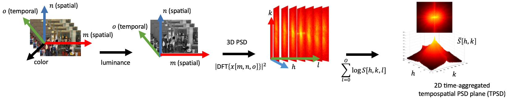

# Power of Tempospatially Unified Spectral Density for Perceptual Video Quality Assessment
This is the MATLAB implementation of our paper:

Mohammed A. Aabed, [Gukyeong Kwon](https://www.linkedin.com/in/gukyeong-kwon/), and [Ghassan AlRegib](https://ghassanalregib.com), "Power of tempospatially unified spectral density for perceptual video quality assessment," 2017 IEEE International Conference on Multimedia and Expo (ICME), Hong Kong, 2017, pp. 1476-1481.\
[[arXiv](https://arxiv.org/abs/1812.05177)] [[IEEE](https://ieeexplore.ieee.org/document/8019333)]

This paper is recognized as a **Finalist of the World's FIRST 10K Best Paper Award (top 3% paper)** @ ICME 2017.


## Abstract
We propose a perceptual video quality assessment (PVQA) metric for distorted videos by analyzing the power spectral density (PSD) of a group of pictures. This is an estimation approach that relies on the changes in video dynamic calculated in the frequency domain and are primarily caused by distortion. We obtain a feature map by processing a 3D PSD tensor obtained from a set of distorted frames. This is a full-reference tempospatial approach that considers both temporal and spatial PSD characteristics. This makes it ubiquitously suitable for videos with varying motion patterns and spatial contents. Our technique does not make any assumptions on the coding conditions, streaming conditions or distortion. This approach is also computationally inexpensive which makes it feasible for real-time and practical implementations. We validate our proposed metric by testing it on a variety of distorted sequences from PVQA databases. The results show that our metric estimates the perceptual quality at the sequence level accurately. We report the correlation coefficients with the differential mean opinion scores (DMOS) reported in the databases. The results show high and competitive correlations compared with the state of the art techniques.


## Temporally Unified Power Spectral Density<p align="center">
We develop a temporally unified power spectral density feature and show that the feature can capture different types, levels, and scene characteristics in a systematic way. 
<p align="center">

</p> 
<p align="center">


</p> 


## Computational Efficiency
The proposed method utilizes 3D PSD which can be simply calcuated using 3D DFT. We show the computatial efficiency of proposed method by comarpaing the computation time required to estimate the quality score of a video with 120 frames. Below are the information about PC that we used for the simulation and the comparision of required computation time from proposed method and other VQA metrics.
- PC information: CORE<sup>TM</sup> i7-6700K CPU @4.00 GHz, 32.0 GB RAM, MATLAB R2015 (b)

<center>

| Metric |VIF | NQM | Proposed  |
|:---:|:---:| :---: |:---:|
| Time [sec] |   255.729| 59.490|***15.030***|

</center>


## Usage & Output Example
Run main.m and below is an example of output:
```
...
3D PSD calculation (tensor 13 / 15)... 
3D PSD calculation (tensor 14 / 15)... 
3D PSD calculation (tensor 15 / 15)... 
Video quality score: 0.101
```

## Citation
If you find our paper and repository useful, please consider citing our paper:

```
@inproceedings{aabed2017power,
  title={Power of tempospatially unified spectral density for perceptual video quality assessment},
  author={Aabed, Mohammed A and Kwon, Gukyeong and AlRegib, Ghassan},
  booktitle={Multimedia and Expo (ICME), 2017 IEEE International Conference on},
  pages={1476--1481},
  year={2017},
  organization={IEEE}
}
```